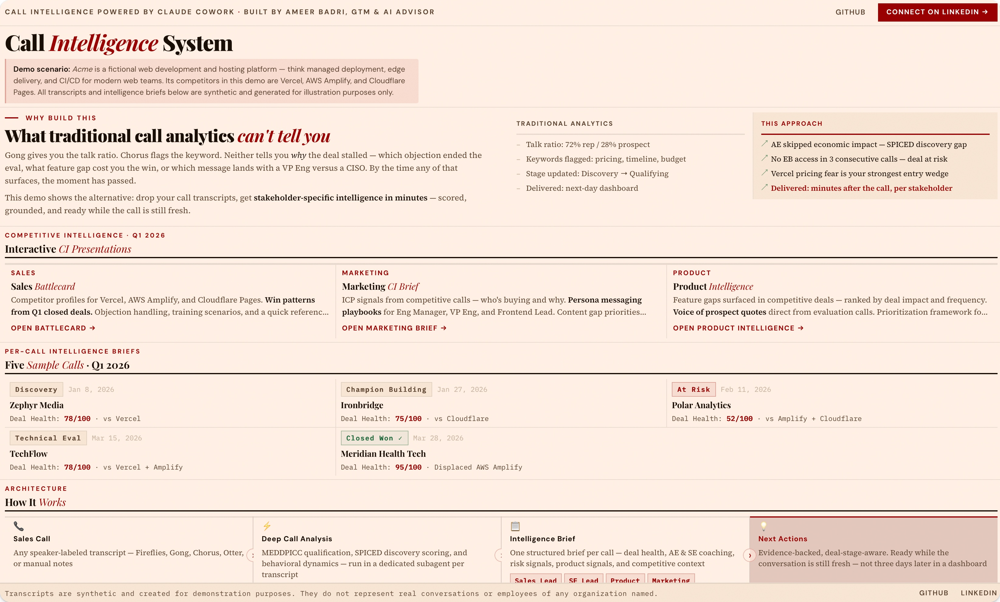
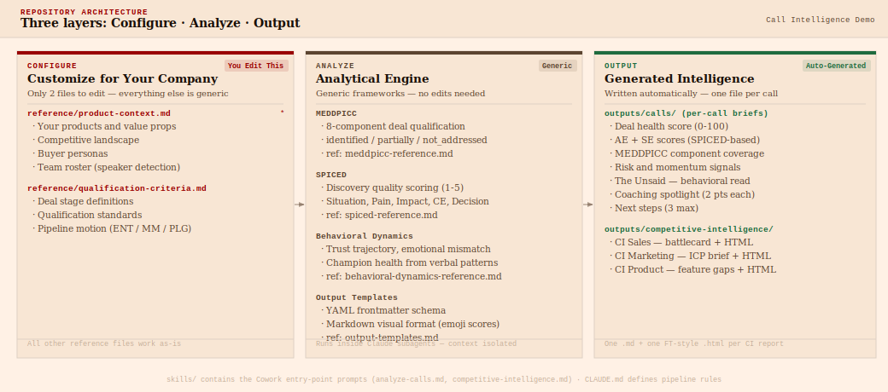
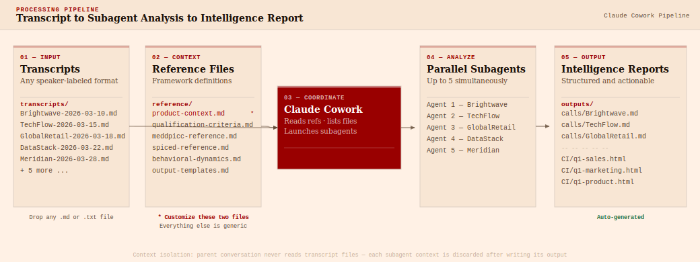

# Call Intelligence — Powered by Claude Cowork

> **Transform raw sales call transcripts into structured, actionable intelligence for Sales, SE, Product, and Marketing leaders.**

**Live demo:** [https://call-intelligence-demo.netlify.app/](https://call-intelligence-demo.netlify.app/)

This repo is a working demonstration of a call intelligence system built with Claude Cowork. It includes 10 synthetic sales call transcripts (featuring a fictional company, **Acme**, competing against real platforms Vercel, AWS Amplify, and Cloudflare Pages) across the full Q1 2026 deal lifecycle — and pre-generated Intelligence Briefs and Competitive Intelligence reports showing exactly what the output looks like.

> **Demo scenario:** Acme is a fictional web development and hosting platform — think managed deployment, edge delivery, and CI/CD for modern web teams. Its competitors in this demo are Vercel, AWS Amplify, and Cloudflare Pages. All transcripts and intelligence briefs are synthetic and generated for illustration purposes only.

**You can use this as:**

- A reference implementation to understand the architecture
- A starting template to adapt for your own company (replace `reference/product-context.md`)
- A demo to understand what AI-powered call intelligence looks like before building your own

---

## Start Here

[](https://call-intelligence-demo.netlify.app/)

**[→ Open the live demo](https://call-intelligence-demo.netlify.app/)** — the fastest way to see what this produces. Three interactive CI presentations (Sales Battlecard, Marketing Brief, Product Intelligence) built from 10 synthetic Q1 calls.

Then come back and read the per-call briefs below — they show the deal-level intelligence that feeds into the CI layer.

---

## What This Repo Generates

| Output | Auto-generated | Quality vs. demo |
|---|---|---|
| **Per-call Intelligence Briefs** | ✅ Yes — one per transcript | Same as the examples in `outputs/calls/` |
| **Competitive Intelligence (markdown)** | ✅ Yes — Sales, Marketing, Product | Good starting point; calibration to your context improves output |
| **Interactive HTML Presentations** | ❌ Pre-generated examples only | See the live demo or install the FT Presentation Skill (below) |

**To generate HTML presentations from your own CI markdown:** install the included `ft-style-presentation.skill` in your Claude app. In Claude Cowork, drag the file into the chat or go to **Settings → Skills → Install from file**. Once installed, ask Claude to render the CI markdown as an HTML presentation and it will produce the same FT-style interactive decks you see in the demo.

---

## See the Output First

The outputs are pre-generated from the 10 sample transcripts. Start with the interactive HTML presentations, then drill into individual call briefs.

**Cross-call Competitive Intelligence** — aggregated across all 10 Q1 calls:

| | |
|---|---|
| [Sales Battlecard](outputs/competitive-intelligence/q1-2026-CI-sales.md) | Competitor profiles, objection handling, training scenarios, win patterns |
| [Marketing CI Brief](outputs/competitive-intelligence/q1-2026-CI-marketing.md) | ICP signals, messaging by persona, content gap priorities |
| [Product Intelligence](outputs/competitive-intelligence/q1-2026-CI-product.md) | Feature gap analysis, competitive roadmap signals, voice of prospect |

Interactive HTML versions (don't render on GitHub) — see the [live demo](https://call-intelligence-demo.netlify.app/) instead.

**Per-call Intelligence Briefs** — all 10 Q1 calls, showing the full deal-stage range:

- [ZephyrMedia-2026-01-08.md](outputs/calls/ZephyrMedia-2026-01-08.md) — Discovery, Vercel pricing spikes triggering CFO alarm, hard Feb deadline
- [CascadeHealth-2026-01-16.md](outputs/calls/CascadeHealth-2026-01-16.md) — Technical evaluation, healthcare compliance requirements, security champion
- [Ironbridge-2026-01-27.md](outputs/calls/Ironbridge-2026-01-27.md) — Champion building, two skeptics converted in real time on quantified operational pain
- [PolarAnalytics-2026-02-11.md](outputs/calls/PolarAnalytics-2026-02-11.md) — At risk, mid-funnel stall after production incident consumed leadership attention
- [StrataCommerce-2026-02-20.md](outputs/calls/StrataCommerce-2026-02-20.md) — Closed won, Cloudflare displaced by edge function runtime advantage
- [Brightwave-2026-03-10.md](outputs/calls/Brightwave-2026-03-10.md) — Discovery with an internal Vercel advocate and a hard Q2 deadline
- [TechFlow-2026-03-15.md](outputs/calls/TechFlow-2026-03-15.md) — Technical evaluation, exceptional SE performance, CTO not yet engaged
- [GlobalRetail-2026-03-18.md](outputs/calls/GlobalRetail-2026-03-18.md) — Multi-stakeholder call, VP Engineering needs ROI case, procurement surfaces unexpectedly
- [DataStack-2026-03-22.md](outputs/calls/DataStack-2026-03-22.md) — Stalled late-stage deal rescued with a pilot strategy
- [Meridian-2026-03-28.md](outputs/calls/Meridian-2026-03-28.md) — Won deal debrief revealing the exact moment and message that closed it

---

## What's in Each Intelligence Brief

Every per-call output contains:


| Section                | What It Tells You                                                                    |
| ---------------------- | ------------------------------------------------------------------------------------ |
| **Deal Summary**       | 3-4 sentence snapshot; deal health score (0-100)                                     |
| **AE Scores**          | SPICED discovery quality, multithreading, next-step execution — scored and evidenced |
| **SE Scores**          | Technical depth, demo effectiveness, objection handling (if SE present)              |
| **MEDDPICC**           | All 8 components scored with one-line evidence notes                                 |
| **Risk & Momentum**    | Top 3 signals — each with severity (🔴🟡🟢) and a "so what"                          |
| **The Unsaid**         | Behavioral read: what the prospect signaled but didn't say                           |
| **Coaching Spotlight** | One strength + one gap per participant, max 2 sentences each                         |
| **Product Signals**    | What features came up, at what intensity, and in what context                        |
| **Next Steps**         | 3 specific actions with owners and timeframes                                        |


---

## How to Run It on Your Own Transcripts

### 1. Prerequisites

- [Claude Cowork](https://claude.ai) (desktop app with Cowork mode)
- A folder of sales call transcripts in text or markdown format

### 2. Configure for Your Company

Edit `**reference/product-context.md`** — replace the Acme-specific content with:

- Your company's products and value propositions
- Your competitive landscape
- Your buyer personas
- Your team roster (so Claude can distinguish your speakers from prospects)

Optionally edit `**reference/qualification-criteria.md`** to match your deal stages and qualification standards.

Everything else (MEDDPICC, SPICED, output templates, behavioral dynamics) is generic and works as-is.

### 3. Add Your Transcripts

Drop transcript files into `transcripts/`. The pipeline works with any speaker-labeled format:

```
**Speaker Name (MM:SS):** What they said...
**Speaker Name (MM:SS):** What they said...
```

Name files: `{Company_Name}-{YYYY-MM-DD}.md`

Common transcript sources: Fireflies, Gong, Chorus, Otter.ai, Zoom AI Summary, or manual notes in the above format.

### 4. Open in Claude Cowork

Open this folder in Claude Cowork and type:

```
Analyze the transcripts in the transcripts folder
```

Claude will:

1. List the transcripts found and confirm scope
2. Read the reference files
3. Launch analysis — one subagent per transcript, up to 5 in parallel
4. Write Intelligence Briefs to `outputs/calls/`

For competitive intelligence across a batch:

```
Generate competitive intelligence for Q1 2026
```

Claude will aggregate competitive signals across analyzed calls and produce three markdown CI documents — one each for Sales, Marketing, and Product. The interactive HTML presentations in this repo are pre-generated examples of what those documents look like when rendered.

---

### What to Expect When You Run This

**On the sample transcripts:** The 10 synthetic Acme transcripts in `transcripts/sample/` are pre-analyzed — the outputs you see in `outputs/` were generated from those exact files. If you re-run analysis on them, Claude will overwrite the existing briefs with freshly generated versions. They should be substantively similar, but not word-for-word identical.

**On your own transcripts:** Drop them into `transcripts/` and update `reference/product-context.md` with your company context. The frameworks (MEDDPICC, SPICED, Behavioral Dynamics) are generic and work as-is. Output quality scales with how well `product-context.md` reflects your actual competitive landscape — the richer the context, the sharper the intelligence.

**What "good" looks like:** The pre-generated outputs in `outputs/` are the benchmark. A well-calibrated run on a strong transcript produces a 1-page brief with scored dimensions, specific evidence quotes, behavioral reads, and 3 owned next steps — all within 60 seconds of the call ending.

**On CI outputs:** Running competitive intelligence produces three markdown documents (Sales, Marketing, Product). The interactive HTML presentations in `outputs/competitive-intelligence/` are pre-generated examples — they show the polished end state, not what auto-generates from a fresh run.

**First run tips:**
- Start with a single transcript to validate output quality before running a full batch
- Check that your team roster in `product-context.md` is accurate — speaker classification (seller vs. prospect) drives everything downstream
- If a brief feels generic, the transcript is likely the constraint (thin transcripts produce thin briefs)

---

## Architecture

The repo has three layers:

- **Configure** (2 files you edit) — `reference/product-context.md` and `reference/qualification-criteria.md` define your company context. Everything else is generic.
- **Analyze** (framework engine) — MEDDPICC, SPICED, and Behavioral Dynamics run inside isolated subagents. No edits needed.
- **Output** (auto-generated) — per-call Intelligence Briefs in `outputs/calls/` and CI reports in `outputs/competitive-intelligence/`.



```
transcripts/                    ← Drop your transcript files here
                                ← 10 synthetic Acme calls pre-populated here

reference/
    product-context.md          ← ★ YOUR COMPANY: products, competitors, team, personas
    qualification-criteria.md   ← ★ Deal stage definitions and qualification standards
    meddpicc-reference.md       ← MEDDPICC component definitions (generic)
    spiced-reference.md         ← SPICED discovery quality framework (generic)
    behavioral-dynamics-reference.md  ← Behavioral read framework (generic)
    output-templates.md         ← Output format and YAML schema (generic)

skills/
    analyze-calls.md            ← Per-call analysis workflow and scoring approach
    competitive-intelligence.md ← Cross-call CI aggregation workflow

CLAUDE.md                       ← Pipeline rules and architecture
SKILL.md                        ← Cowork entry point skill

outputs/
    calls/                      ← Your analyzed calls will appear here
    competitive-intelligence/   ← Your CI reports will appear here
```

> **Note on the skills files:** `skills/analyze-calls.md` and `skills/competitive-intelligence.md` describe the analytical approach and workflow structure. The output quality you see in this demo reflects calibration that is adapted to each deployment — matching the scoring standards to your deal motion, your competitive landscape, and your team's coaching priorities. Think of the skills files as the architecture diagram, not the finished build.

### Processing Pipeline



### Context Management

The parent conversation **never reads transcript files directly**. Each transcript is analyzed in a dedicated subagent whose context is discarded after writing the output file. This prevents token exhaustion on large transcript volumes.

**Parent reads:** reference files, output summaries, CI documents
**Subagents read:** one transcript + all reference files → write one `.md` output

Up to 5 subagents run in parallel for batch processing.

---

## The Analytical Frameworks

### MEDDPICC (Deal Qualification)

Eight components — Metrics, Economic Buyer, Decision Criteria, Decision Process, Paper Process, Identified Pain, Champion, Competition — each scored as `identified`, `partially`, or `not_addressed` per call.

This answers: *"Do we actually understand this deal, or are we just hoping?"*

### SPICED (Discovery Quality)

Five stages — Situation, Pain, Impact, Critical Event, Decision — scored as a composite 1-5 to assess how effectively the AE ran the discovery conversation.

This answers: *"Did the AE drive the conversation, or did they just collect information?"*

### Behavioral Dynamics

Three dimensions — Trust Trajectory, Emotional Mismatch, Champion Health — assessed from verbal behavior patterns in the transcript.

This answers: *"What did the prospect signal that they didn't say directly?"*


---

## Adapting This to Your Stack and the "Last Mile" Problem

The code in this repository is just the engine. The real challenge of deploying AI for GTM isn't writing the prompt or setting up the infrastructure—it's the "Last Mile" problem.

To make this actually work in production, you have to:

- **Map the AI to your specific product context** — teaching the system your true competitive landscape, unspoken buyer hesitations, and complex value props.
- **Secure the data** — handling PII, sensitive deal data, and routing securely between your CRM and the LLM.
- **Drive GTM team adoption** — ensuring AEs, SEs actually read the coaching feedback and Product/Marketing trust the AI's signal.

If you want to port this out of Cowork, the analytical quality comes from the framework references and output templates. The Claude Cowork layer can be replaced with:

- **Direct API calls** — port the prompts in `skills/` to the Anthropic API with any language
- **Any transcript source** — Fireflies, Gong, Chorus, Otter.ai, Zoom, manual notes
- **Any knowledge base** — Notion, Confluence, SharePoint, or just this repo
- **Any CRM** — HubSpot, Salesforce, or none (the pipeline works without CRM enrichment)

---

## Hosting website

This is a static site: root `index.html` plus `outputs/` for the competitive intelligence HTML presentations. Pick either option below.

### GitHub Pages

The repo works with GitHub Pages out of the box. The root `index.html` is the landing page and links to the three CI HTML presentations.

**Setup (2 minutes):**

1. Push this repo to GitHub
2. Go to **Settings → Pages**
3. Under "Source", select **Deploy from a branch**
4. Select branch `main`, folder `/ (root)`
5. Click **Save**

Your site will be live at: `https://{your-username}.github.io/call-intelligence-demo-claude-cowork`

Update the live demo link at the top of this README once it's deployed.

### Netlify

In the Netlify UI, connect the repo and set **Publish directory** to `/` (repo root), or use **Deploy manually** and drag the project folder. No build command is required. Netlify provides a `*.netlify.app` URL (and optional custom domain) and optional site password protection.

---

## About

Built by **Ameer Badri, GTM & AI Advisor at PredictiveTrends**.

This demo is based on a version of this system implemented at a customer — a real deployment producing weekly call intelligence for Sales, SE, Product, and Marketing leadership teams.

Want to deploy a customized version of this for your GTM team? Let's talk.

[Connect on LinkedIn →](https://linkedin.com/in/ameer)

---

*All transcripts are synthetic and created for demonstration purposes. "Acme" is a fictional company. The competitive landscape referenced (Vercel, AWS Amplify, Cloudflare Pages) is real but all conversations, data, and outcomes are illustrative only.*

---

## License

MIT — see [LICENSE](LICENSE)